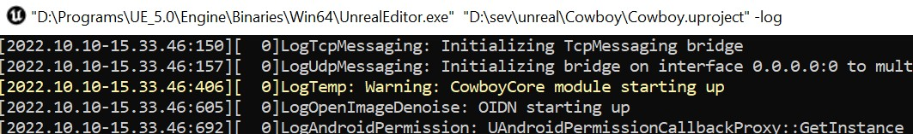

# Creación del proyecto

## Carpeta del juego

Crearemos una nueva carpeta llamada `Cowboy`, donde residirá todo nuestro juego.

Abriremos esa carpeta con Visual Studio Code (o cualquier otro editor) y aprovecharemos para abrir una terminal. Podemos escoger qué tipo de terminal lanzar, los comandos que veremos a continuación están pensados para CMD, por lo tanto debemos usar `Command Prompt` como terminal:


En esta terminal, inicializaremos un proyecto de Git, que nos servirá para llevar el control de los cambios que hacemos en nuestro juego y entender mejor qué cambios hace Unreal Engine:

```sh
$ git init
```

> Nota: Por conveniencia, de aquí en adelante, llamaremos *UE* a *Unreal Engine*

### Gitignore

Crearemos un fichero llamado `.gitignore` que nos servirá para no tener en cuenta las carpetas temporales que genera UE. Este fichero tendrá el siguiente contenido:

```sh
# UE temporal folders
Binaries
DerivedDataCache
Intermediate
Saved
Build

# Editor files and artifacts
.vscode
.vs
*.VC.db
*.opensdf
*.opendb
*.sdf
*.sln
*.suo
*.xcodeproj
*.xcworkspace
.idea

# Plugin for Rider IDE
Plugins/Developer/RiderLink/

# Mac related files
.DS_Store

# Editor path variables file
editor_vars.bat
```

## Ficheros principales

### UProject

Como hemos visto en teoría, el único fichero obligatorio y que define nuestro proyecto es el `.uproject`. 

Por lo tanto, vamos a crear en la raíz de nuestro juego este fichero con el nombre de nuestro proyecto `Cowboy.uproject`, que tendrá el siguiente contenido:

```json
{
    "FileVersion": 3,
    "EngineAssociation": "5.0",
    "Category": "",
    "Description": "",
    "Modules": [
        {
            "Name": "CowboyCore",
            "Type": "Runtime",
            "LoadingPhase": "Default"
        }
    ]
}
```

Las partes importantes dentro del fichero anterior son:
 - `"EngineAssociation"`: Aquí indicamos la versión del motor de UE que queremos utilizar. Se puede cambiar en cualquier momento, e incluso UE nos ofrece utilidades para hacer la migración.
 - `"Modules"`: Si en nuestro juego solo vamos a utilizar Blueprints, esta parte no es necesaria. Pero si queremos escribir C++, aquí es necesario que declaremos que Módulos (que estarán en subcarpetas) queremos compilar.

En nuestro caso, vamos a crear más adelante un solo Módulo que será `CowboyCore`. Aquí podemos utilizar el nombre que queramos, pero como es el módulo principal, por eso lo llamamos _"Core"_.

### Unreal Build Tool

Dentro de la raíz de nuestro juego (al mismo nivel que nuestro `Cowboy.uproject`), crearemos una carpeta `Source`, dentro de esta carpeta residirán todos los ficheros y módulos de C++ de nuestro proyecto.

Como hemos visto en las clases de teoría, [Unreal Build Tool (o UBT)](https://docs.unrealengine.com/4.27/en-US/ProductionPipelines/BuildTools/UnrealBuildTool/) lee ficheros de C# en los que se definen tanto nuestro juego, como los módulos a compilar.

A nivel general de nuestro juego, debemos crear dos ficheros:

Un fichero `Source/Cowboy.Target.cs` para el build general de nuestro proyecto:

```cs
using UnrealBuildTool;

public class CowboyTarget : TargetRules
{
    public CowboyTarget(TargetInfo Target) : base(Target)
    {
        Type = TargetType.Game;
        DefaultBuildSettings = BuildSettingsVersion.V2;
        ExtraModuleNames.AddRange( new string[] { "CowboyCore" });
    }
}
```

Y un fichero `Source/CowboyEditr.Target.cs` para el build de nuestro proyecto con editor:


```cs
using UnrealBuildTool;

public class CowboyEditorTarget : TargetRules
{
    public CowboyEditorTarget(TargetInfo Target) : base(Target)
    {
        Type = TargetType.Editor;
        DefaultBuildSettings = BuildSettingsVersion.V2;
        ExtraModuleNames.AddRange( new string[] { "CowboyCore" });
    }
}
```

En estos ficheros, lo importante es indicar que los módulos a compilar. En nuestro caso, sólo es el módulo `CowboyCore`.

> Nota: Si quieres saber sobre este tipo de ficheros, échale un ojo a los [Targets de UBT aquí](https://docs.unrealengine.com/4.27/en-US/ProductionPipelines/BuildTools/UnrealBuildTool/TargetFiles/).

## Módulo `CowboyCore`

Ahora que ya tenemos la estructura principal de nuestro proyecto, nos quedaría crear los archivos principales de nuestro módulo principal `CowboyCore`.
Dentro de la carpeta `Source`, crearemos una carpeta llamada `CowboyCore` y dentro de ella crearemos el último fichero necesario que UBT necesita sobre nuestro módulo, este fichero se llamará `Source/CowboyCore/CowboyCore.Build.cs`:

```cs
using UnrealBuildTool;


public class CowboyCore : ModuleRules
{
    public CowboyCore(ReadOnlyTargetRules Target) : base(Target)
    {
        PCHUsage = PCHUsageMode.UseExplicitOrSharedPCHs;

        PublicDependencyModuleNames.AddRange(new string[] { "Core", "CoreUObject", "Engine" });
        PrivateDependencyModuleNames.AddRange(new string[] { });
    }
}
```

El objetivo principal de este fichero es indicar qué dependencias, de otros módulos, necesitamos. En este caso en específico usaremos los módulos [`Core`](https://github.com/EpicGames/UnrealEngine/tree/release/Engine/Source/Runtime/Core), [`CoreUObject`](https://github.com/EpicGames/UnrealEngine/tree/release/Engine/Source/Runtime/CoreUObject) y [`Engine`](https://github.com/EpicGames/UnrealEngine/tree/release/Engine/Source/Runtime/Engine) que UE nos proporciona. Más adelante incluiremos uno más.

Por último, lo último que necesitamos para tener nuestro módulo listo es crear una clase de C++ que extienda de la interfaz [`IModuleInterface`](https://github.com/EpicGames/UnrealEngine/blob/release/Engine/Source/Runtime/Core/Public/Modules/ModuleInterface.h).

De este modo crearemos un fichero `Source/CowboyCore/CowboyCore.h` y otro `Source/CowboyCore/CowboyCore.cpp`.

Aquí existen dos alternativas:
1. La más sencilla: Crear una cabecera vacía y una unidad de compilación que su única línea sea: 
    ```cpp
    IMPLEMENT_PRIMARY_GAME_MODULE(FDefaultGameModuleImpl, CowboyCore, "CowboyCore");
    ```
    Esta es la más común. El macro [`IMPLEMENT_PRIMARY_GAME_MODULE`](https://github.com/EpicGames/UnrealEngine/blob/release/Engine/Source/Runtime/Core/Public/Modules/ModuleManager.h#L916) recibe la clase que implementa el módulo y el nombre del módulo (el tercer parámetro era el nombre del juego, pero está deprecado, solo hay que añadirlo por retrocompatibilidad).

    Por lo tanto, en este caso sencillo, el macro usará una implementación genérica de un módulo [`FDefaultGameModuleImpl`](https://github.com/EpicGames/UnrealEngine/blob/release/Engine/Source/Runtime/Core/Public/Modules/ModuleManager.h#L716) y así no tenemos que añadir más código.
2. La más completa: Crear una clase que implemente `IModuleInterface` y extenderla de algún modo.

En nuestro caso, vamos a optar por la opción _2_. Así que el fichero `Source/CowboyCore/CowboyCore.h` tendrá este código:

```cpp
#pragma once

#include "CoreMinimal.h"
#include "Modules/ModuleInterface.h"

class FCowboyCore : public IModuleInterface
{
private:
	virtual void StartupModule() override;
	virtual void ShutdownModule() override;
};

```

Y el fichero `Source/CowboyCore/CowboyCore.cpp` tendrá este código:

```cpp
#include "CowboyCore.h"
#include "Modules/ModuleManager.h"


void FCowboyCore::StartupModule()
{
	UE_LOG(LogTemp, Warning, TEXT("CowboyCore module starting up"));

}

void FCowboyCore::ShutdownModule()
{
	UE_LOG(LogTemp, Warning, TEXT("CowboyCore module shutting down"));
}

IMPLEMENT_PRIMARY_GAME_MODULE(FCowboyCore, CowboyCore, "CowboyCore");
```

Cosas importantes a tener en cuenta:
- La clase se llama `FCowboyCore`, con `F` de prefijo, debido a que no extiende de `UObject`, ni ninguna clase en su jerarquía, siguiendo los [prefijos que vimos clase de teoría](https://docs.unrealengine.com/5.0/en-US/epic-cplusplus-coding-standard-for-unreal-engine/) (ojo, el fichero no tiene el prefijo).
- Sobreescribimos los métodos `StartupModule` y `ShutdownModule`, que serán llamados cuando se levanta el módulo. En nuestro caso la fase en la que esto ocurrirá es en la [`Default`](https://docs.unrealengine.com/5.0/en-US/API/Runtime/Projects/ELoadingPhase__Type/), tal y como hemos definido anteriormente dentro de `Cowboy.uproject`.
- Para escribir directamente en el log, usamos el macro [`UE_LOG`](https://unrealcommunity.wiki/logging-lgpidy6i) pasándole la categoría `LogTemp` y el nivel `Warning`. Más adelante crearemos nuestra propia categoría de logging.
- Al usar `IMPLEMENT_PRIMARY_GAME_MODULE`, esta vez le pasamos nuestra clase `FCowboyCore`, en lugar de `FDefaultGameModuleImpl`.

> Nota: Más info sobre [Gameplay Modules aquí](https://docs.unrealengine.com/5.0/en-US/gameplay-modules-in-unreal-engine/).


## Compilación y ejecución del editor

Ahora que ya tenemos los ficheros necesarios, podemos 1) llamar a UBT para que compile nuestro juego y 2) usar el editor compilado para lanzar nuestro juego. Como vimos en teoría, si fuera un proyecto sin C++ (solo Blueprints) no sería necesario el paso 1.


### Compilación

Para llamar a UBT y que compile nuestro proyecto tendríamos que ejecutar el siguiente comando en la terminal:

```sh
$ D:\Programs\UE_5.0\Engine\Build\BatchFiles\Build.bat CowboyEditor Win64 Development D:\sev\UnrealEngineCowboy\Cowboy\Cowboy.uproject -waitmutex -NoHotReload

```

Entendiendo este comando por partes:
1. `D:\Programs\UE_5.0` es la carpeta donde tengo instalado Unreal Engine. Esto **se debería modificar** dependiendo de dónde está instalado Unreal Engine, o dependiendo de la versión que se quiera usar.
2. `Engine\Build\BatchFiles\Build.bat` es la carpeta y el fichero que invocarán a UBT.
3. `CowboyEditor` es el nombre de nuestro juego, junto al [Build Target](https://docs.unrealengine.com/5.0/en-US/build-configurations-reference-for-unreal-engine/) que queremos compilar.
4. `Win64` es la plataforma para la que queremos compilar.
5. `Development` es el [Build State](https://docs.unrealengine.com/5.0/en-US/build-configurations-reference-for-unreal-engine/) que queremos compilar. Existen otros States como por ejemplo `Debug` o `Shipping`.
6. `D:\sev\UnrealEngineCowboy\Cowboy` es la dirección absoluta de la carpeta de nuestro juego. **Se debe modificar** por la dirección de la carpeta donde hemos creado nuestro proyecto.
7. `Cowboy.uproject` es el nombre de nuestro fichero `.uproject`.

Una vez este comando se ejecute con éxito, se no habrán creado la carpeta `Intermediate` con ficheros generados automáticamente y la carpeta de `Binaries\Win64` donde tendremos un fichero `UnrealEditor-CowboyCore.dll`, el cual contiene todo nuestro juego en C++ como una librería dinámica.

### Ejecución

Ahora para levantar el editor y empezar a usar Unreal Engine, sólo deberíamos ejecutar el siguiente comando:

```sh
$ D:\Programs\UE_5.0\Engine\Binaries\Win64\UnrealEditor.exe D:\sev\UnrealEngineCowboy\Cowboy\Cowboy.uproject -log
```

Entendiendo este comando por partes:
1. `D:\Programs\UE_5.0` carpeta de UE.
2. `Engine\Binaries\Win64\UnrealEditor.exe` carpeta y ejecutable del editor de UE. Como estamos compilando nuestro juego como una librería (no lo estamos empaquetando de momento en un solo `.exe`), ejecutamos el editor.
3. `D:\sev\UnrealEngineCowboy\Cowboy\Cowboy.uproject` nuestro `.uproject` como dirección absoluta.
4. `-log` para que se nos inicie una terminal mostrándonos el log de UE. Aquí vamos a ver esos mensajes de log que declaramos anteriormente en `FCowboyCore`.



Una vez ejecutemos este comando, se nos creará una carpeta temporal llamada `DerivedDataCache` y otra llamada `Saved`, donde se guardarán todos nuestro logs (además de verlo en la consola) dentro de la carpeta `Saved/Logs`.
También, como se trata de la primera ejecución, se nos creará la carpeta `Content`.

### Scripts de ayuda

Para evitar tener que memorizar estos comandos, vamos a crear 4 scripts en la raíz de nuestro proyecto (al mismo nivel que `Cowboy.uproject`).

1. Un fichero llamado `editor_vars.bat` para definir la carpeta global de nuestro editor.  Como este fichero está ignorado en el `.gitignore` (para evitar problemas si colaboramos con otros ordenadores), es necesario crearlo cada vez que clonemos nuestro proyecto:
    ```bat
    @echo off

    set UNREAL_EDITOR_DIR=D:\Programs\UE_5.0
    ```
    Esta dirección **se debe sustituir** con la carpeta pertinente.
2. Un fichero llamado `vars.bat`, donde declararemos el resto de variables comunes:
    ```bat
    @echo off

    call %~dp0\editor_vars.bat
    set PROJECT=Cowboy

    set ROOTDIR=%~dp0
    set ROOTDIR=%ROOTDIR:~0,-1%

    set UPROJECT=%ROOTDIR%\%PROJECT%.uproject

    set UNREAL_EDITOR_EXE=%UNREAL_EDITOR_DIR%\Engine\Binaries\Win64\UnrealEditor.exe
    set BUILD_BAT=%UNREAL_EDITOR_DIR%\Engine\Build\BatchFiles\Build.bat
    ```
3. Un fichero llamado `build.bat`, que nos servirá para compilar nuestro proyecto:
    ```bat
    @echo off

    call %~dp0\vars.bat

    call "%BUILD_BAT%" %PROJECT%Editor Win64 Development "%UPROJECT%" -waitmutex -NoHotReload
    ```
4. Y un fichero llamado `editor.bat`, que nos servirá para lanzar el editor:
    ```bat
    @echo off

    call %~dp0\vars.bat

    start "" "%UNREAL_EDITOR_EXE%" "%UPROJECT%" %*
    ```

Con estos ficheros, ahora es tan sencillo como ejecutar el siguiente comando para compilar el proyecto:

```sh
$ build
```

Y el siguiente comando para ejecutarlo:

```sh
$ editor
```

También podríamos ejecutarlos de manera secuencial (siempre y cuando el build tenga éxito):

```sh
$ build && editor
```

---

## Siguiente

En el siguiente paso veremos la importación de assets, pero antes guardaremos y haremos commit de nuestro cambios en Git:

```sh
$ git add .
$ git commit -m "Create base project structure"
```

[Ir al siguente](02_assets_import.md)
