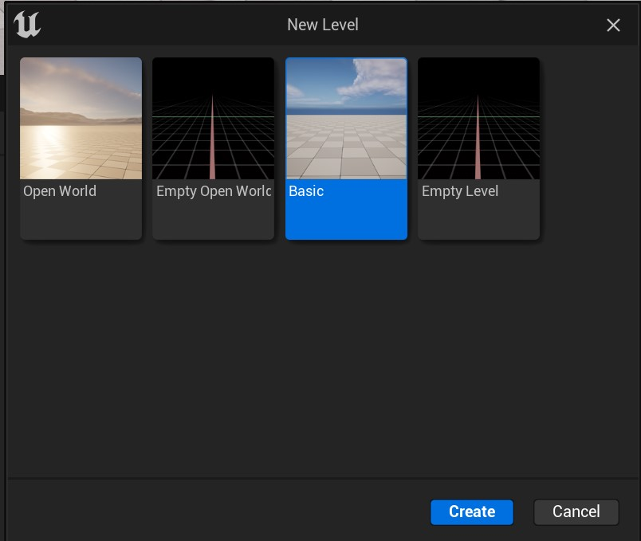
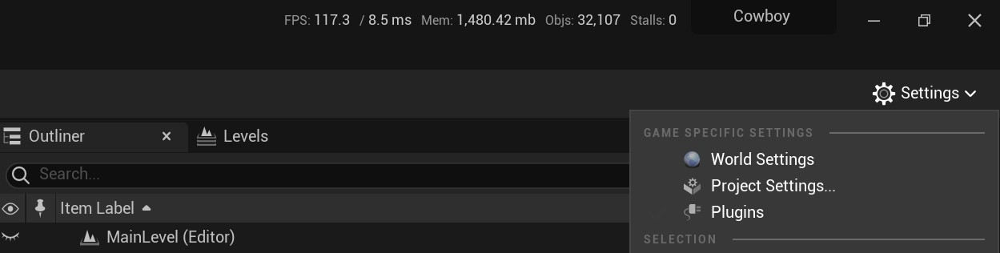
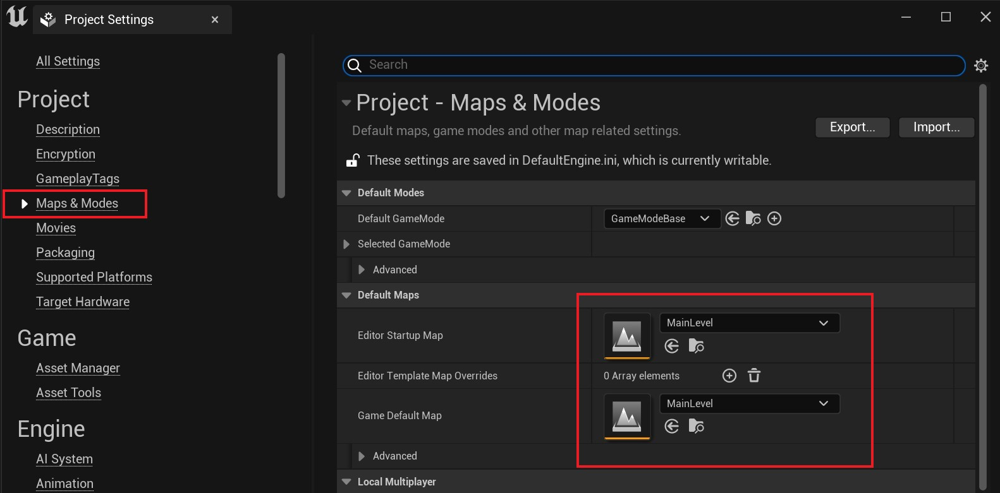

[Volver al anterior](01_project_creation.md)

# Importación de Assets

En esta sección crearemos nuestro primer nivel y aprovecharemos para importar todos los assets que usaremos más adelante.

## Creación del nivel

Si no tenemos el editor levantado, podemos lanzarlo con el comando que creamos en la sección anterior:

```
$ editor
```

Una vez que tenemos el editor abierto, con el atajo <kbd>ctrl</kbd> + <kbd>N</kbd> crearemos un nuevo nivel y usaremos la plantilla _Basic_:



Ahora con <kbd>ctrl</kbd> + <kbd>S</kbd> lo guardaremos y le daremos el nombre de `MainLevel`.

Si vamos a la terminal y escribimos `git add .` y `git status --short`, veremos algo similar a lo siguiente:


```sh
$ git status --short
A  Content/MainLevel.umap
A  Content/MainLevel_BuiltData.uasset
```

Así que podemos hacer un commit para indicar que hemos creado un nuevo nivel:

```sh
$ git commit -m "Add new level"
```

## Configuración del nivel

Como hemos visto en teoría, el punto de partida para cualquier juego de UE es un [`UWorld`](https://docs.unrealengine.com/5.0/en-US/API/Runtime/Engine/Engine/UWorld/), (y aunque podamos pasarle como parámetro por consola qué nivel queremos abrir) deberíamos configurar los mapas por defecto que queremos, tanto en el editor, como en nuestro juego en _Standalone_.

Para ello, la forma más fácil es ir a _Project Settings_:



Y dentro de la sección de _Maps & Modes_, modificar los mapas por defecto:



Una vez que lo hagamos, veremos que nuestra carpeta de `Config` se ha modificado un archivo llamado `DefaultEngine.ini`. Ahí podremos reflejada ver la configuración que acabamos de hacer:

```ini
[/Script/EngineSettings.GameMapsSettings]
EditorStartupMap=/Game/MainLevel.MainLevel
GameDefaultMap=/Game/MainLevel.MainLevel
```

> Nota: Si quisieramos, podriamos modificar a mano los archivos .ini cuando queramos.

## Importación de assets


---

## Siguiente

En el siguiente paso crearemos nuestras clases de C++, pero antes guardaremos y haremos commit de nuestro cambios en Git:

```sh
$ git add .
$ git commit -m "Add assets"
```

[Ir al siguente](03_main_classes.md)
