# Clases principales

[Volver al anterior](02_assets_import.md)

## Log

Lo primero que haremos, para recordar nuestro proceso de compilación, es crear una categoría de log nueva para nuestro juego.

Crearemos un fichero `Source/CowboyCore/Log.h` con este contenido:

```cpp
#pragma once

#include "Logging/LogMacros.h"

DECLARE_LOG_CATEGORY_EXTERN(LogCowboyCore, All, All);
```

Y un fichero `Source/CowboyCore/Log.cpp`:

```cpp
#include "Log.h"

DEFINE_LOG_CATEGORY(LogCowboyCore);
```

Esto ha definido una nueva categoría de logging llamada `LogCowboyCore`, que podremos usar para agrupar los mensajes específicos de nuestro juego.

### Actualizar mensajes de log

Ahora que tenemos nuestra categoría de log, modificaremos el fichero `Source/CowboyCore/CowboyCore.cpp`:


```diff
 #include "CowboyCore.h"
 #include "Modules/ModuleManager.h"
+#include "Log.h"

 void FCowboyCore::StartupModule()
 {
-       UE_LOG(LogTemp, Warning, TEXT("CowboyCore module starting up"));
+       UE_LOG(LogCowboyCore, Warning, TEXT("CowboyCore module starting up"));

 }
 
 void FCowboyCore::ShutdownModule()
 {
-       UE_LOG(LogTemp, Warning, TEXT("CowboyCore module shutting down"));
+       UE_LOG(LogCowboyCore, Warning, TEXT("CowboyCore module shutting down"));
```

Finalmente, podemos compilar y reabrir el editor con:

```sh
$ build && editor
```

> Si tenemos el editor abierto, podemos usar la funcionalidad de [Live Coding](https://docs.unrealengine.com/5.0/en-US/using-live-coding-to-recompile-unreal-engine-applications-at-runtime/) con las teclas <kbd>ctrl</kbd> + <kbd>alt</kbd> + <kbd>F11</kbd>.

Dentro del editor, también podemos ver los logs y filtrarlos por categoría. Ahora veremos la categoría que hemos creado:

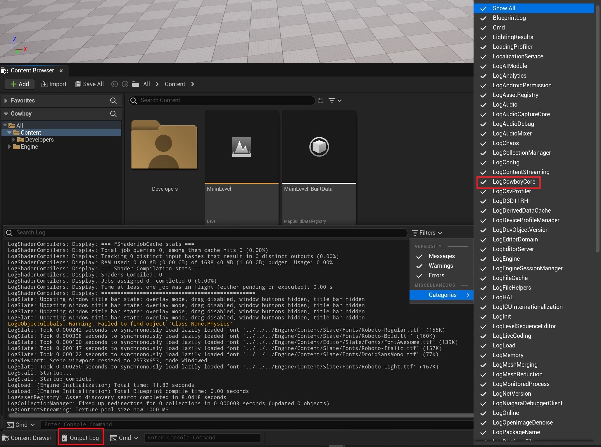

Y si solo seleccionamos nuestra categoría, veremos el mensaje filtrado:

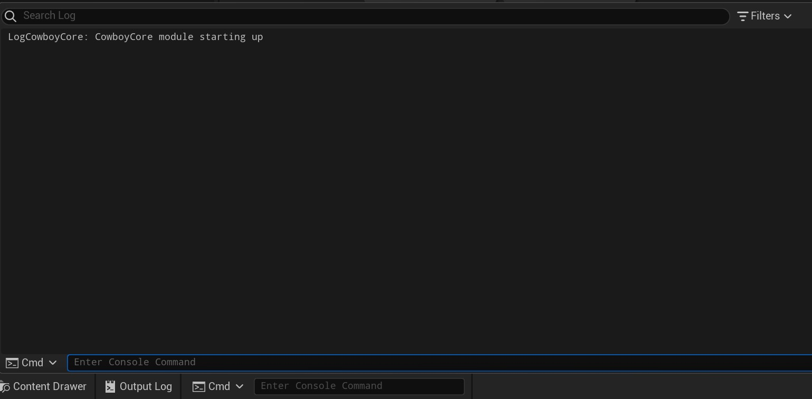

## Rider

Ahora que ya conocemos todo el flujo básico para compilar y ejecutar nuestro juego con Unreal Engine, y entendemos que no es magia cómo funciona por debajom, podemos dar un paso más allá y utilizar un IDE que nos permita ser mucho más productivos y evitar tener que ejecutar todos esos comandos por nuestra cuenta.

Podríamos usar Visual Studio, pero ya que con la cuenta de correo de UniOvi podemos usar los productos de JetBrains, [Rider](https://www.jetbrains.com/rider/) es una mejor opción con diferencia, ya que tiene un soporte específico para Unreal Engine.

Lo único que necesitamos, es generar una solución para nuestro proyecto y abrirla con Rider:

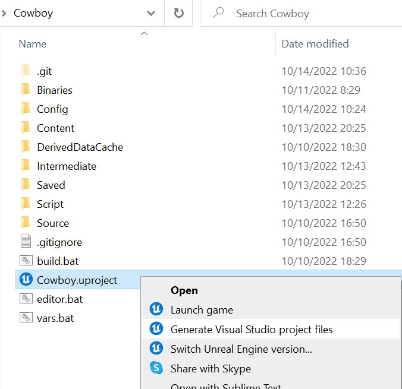
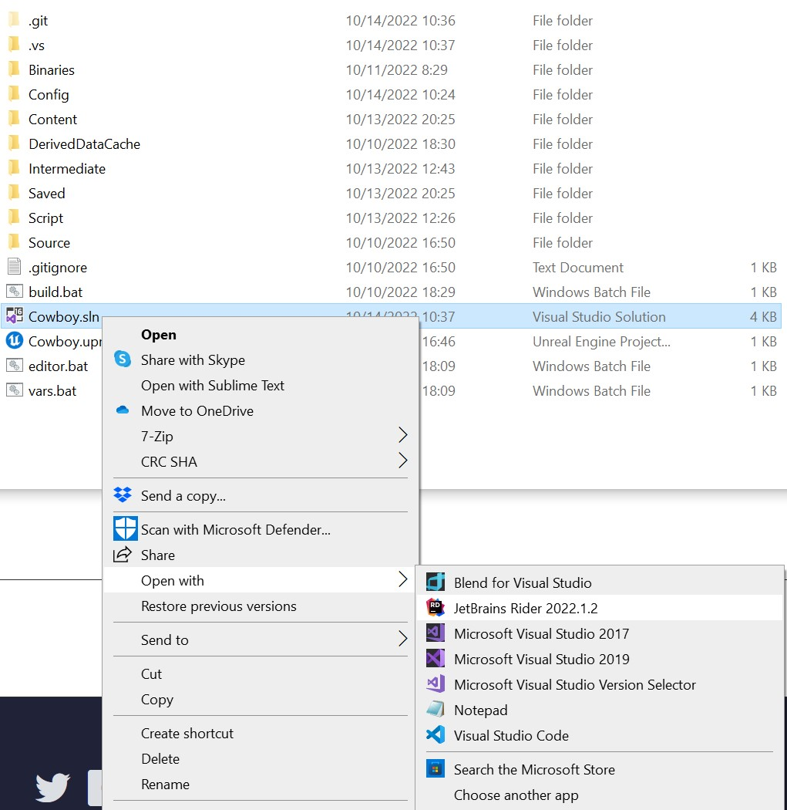

La primera vez que abramos el proyecto, nos mencionará si queremos instalar [Rider Link](https://www.jetbrains.com/help/rider/Unreal_Engine__UnrealLink_RiderLink.html), aceptaremos:

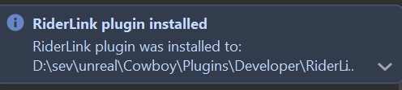


### Conceptos importantes

Una vez abierta la solución con Rider, veremos las siguientes partes:

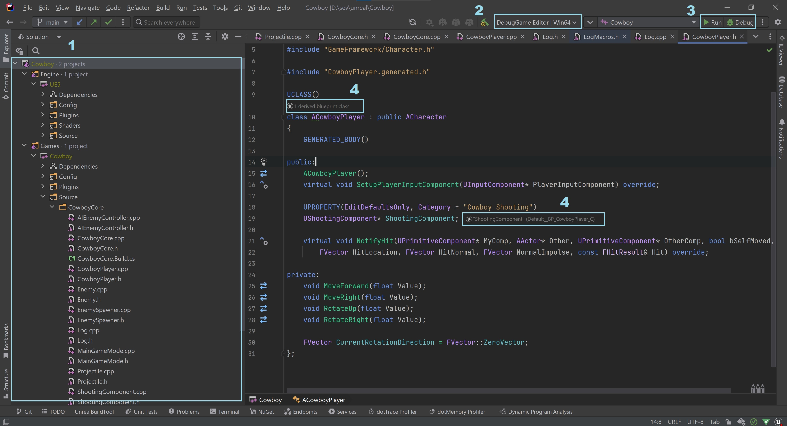

1. **Explorador de proyectos**: aquí veremos tanto nuestro juego, como el código de UE si lo hemos seleccionado para descargar en el Epic Games Launcher.

    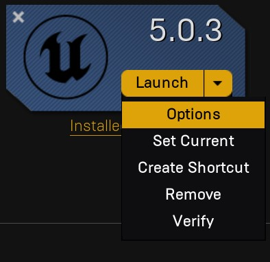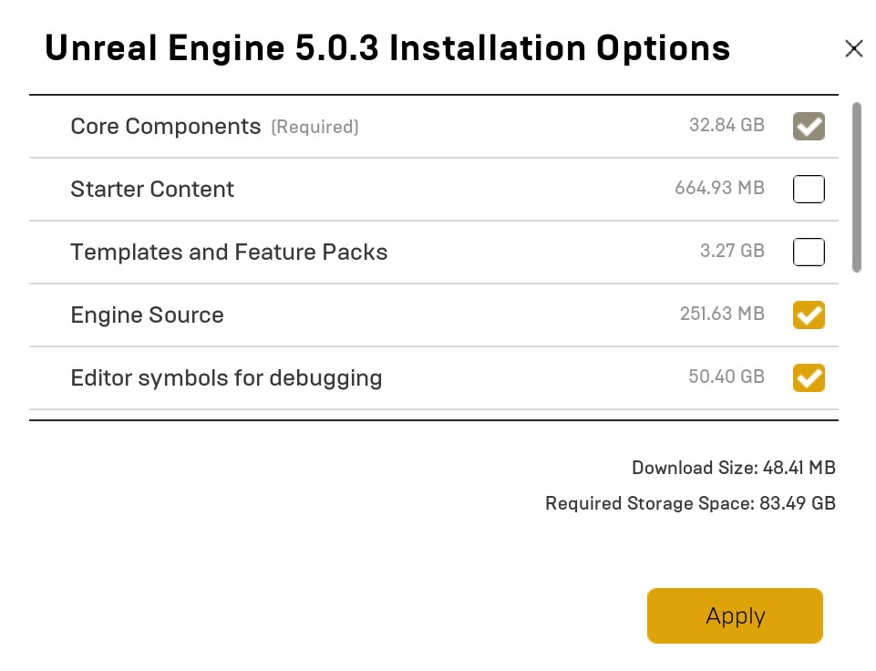

    Desde aquí, con el botón derecho, también podríamos crear directamente nuestras clases:

    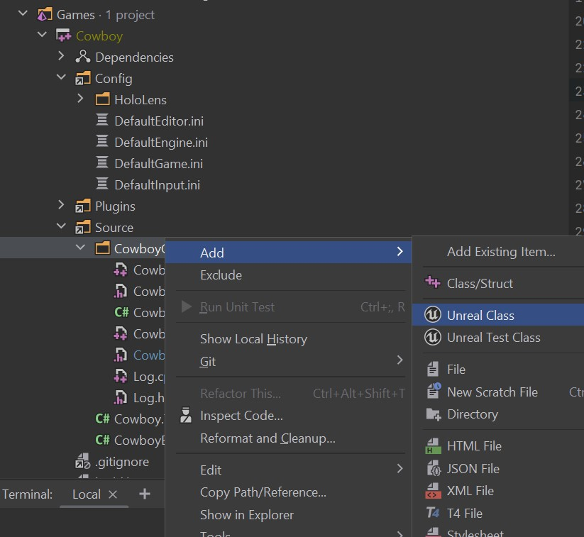

2. **Target para hacer el build**: Como vimos anteriormente, hay diferentes tipos de Targets para los que hacer el build de nuestro proyecto, aquí podemos seleccionar cual queremos de manera sencilla:
    
    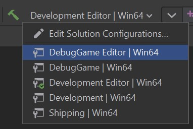

3. **Botones de run y debug**: Estos botones nos permitirán hacer los pasos de `build` y `editor` que antes hacíamos a mano. Además, si le damos al botón de debug, también podremos poner breakpoints en nuestro código de C++ (o en el del editor si estamos con el target Debug o Development y tenemos los símbolos de debug instalados).
4. **Herencia en Blueprints**: Rider es suficientemente listo para indicarnos cuándo hay Blueprints herendando de una clase de C++, o usando un método o una propiedad, y nos lo indicará aquí.

## Cowboy

Primero crearemos la clase base de nuestro vaquero. Para ello crearemos una clase de Unreal Engine que herede de Character:

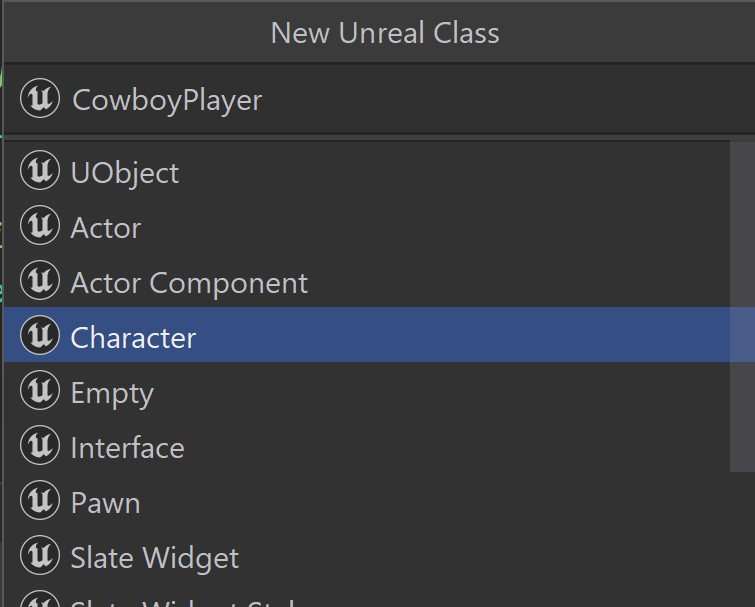


> Nota: Rider nos adaptará el nombre de la clase (que no el del fichero) a los prefijos correspondientes dependiendo de la clase que heredemos. En este caso: `ACowboyPlayer`.


De momento, el contenido de `CowboyPlayer.h` será el siguiente:

```cpp
#pragma once

#include "CoreMinimal.h"
#include "GameFramework/Character.h"

#include "CowboyPlayer.generated.h"

UCLASS()
class COWBOYCORE_API ACowboyPlayer : public ACharacter
{
	GENERATED_BODY()

public:
	ACowboyPlayer();
};
```

Varios puntos a entender de una clase de C++ con Unreal Engine:
1. Cuando tenemos una clase que hereda de `UObject`, se le creará una cabecera autogenerada cuando Unreal Build Tool haga su proceso. Esa cabecera tendrá el nombre del fichero con un `generated` en medio. Aunque la primera vez no exista, es necesario incluirla sí o sí. En nuestro caso es `CowboyPlayer.generated.h`.
2. La directiva `UCLASS()` permite indicar a UnrealHeaderTool que genere todo el código necesario para nuestra clase. Además aquí podríamos indicar un montón de especificadores, como por ejemplo que la clase sea Abstracta y no pueda ser instanciada directamente. Puedes leer más sobre los [especificadores aquí](https://benui.ca/unreal/uclass/).
3. También necesitamos la directiva `COWBOYCORE_API` entre `class` y `ACowboyPlayer` específica de nuestro módulo, para que esta clase sea _exportable_. 
4. La directiva `GENERATED_BODY()` es obligatorio añadirla porque creará constructores y todo el cuerpo que Unreal Engine necesita de una clase. En algunos sitios podrás ver que alguien usa `GENERATED_UCLASS_BODY()` en su lugar, pero es mejor usar siempre `GENERATED_BODY()` como regla general.


Y el código de su unidad de compilación `CowboyPlayer.cpp`:

```cpp
#include "CowboyPlayer.h"

ACowboyPlayer::ACowboyPlayer()
{
}
```

Por el momento esta clase no tendrá lógica, pero la implementaremos después.

### Blueprint

Si ahora le damos al botón de _Run_ dentro de Rider, podremos levantar el editor y pasar a crear el Blueprint que heredará de esta clase de C++ para nuestro Vaquero.

Crearemos un Blueprint que herede de esta clase, llamado BP_CowboyPlayer:

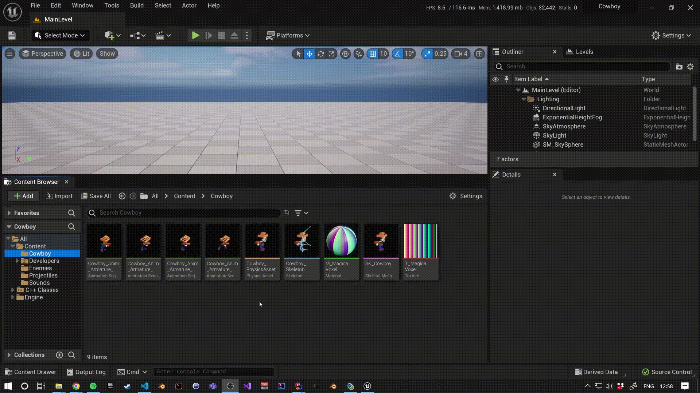

En este Blueprint, añadiremos la malla esqueletal que habíamos importado anteriormente:

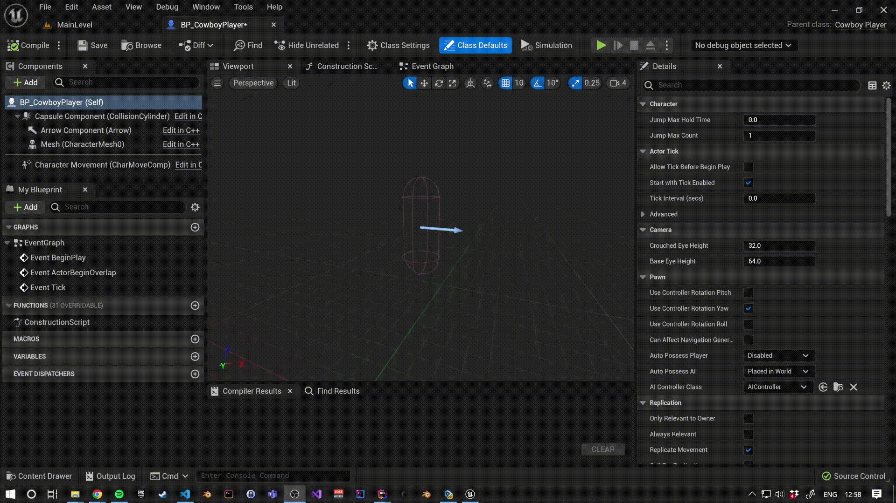

También crearemos un Spring Arm y una Cámara, para que indicar cómo se va a visualizar nuestro actor:


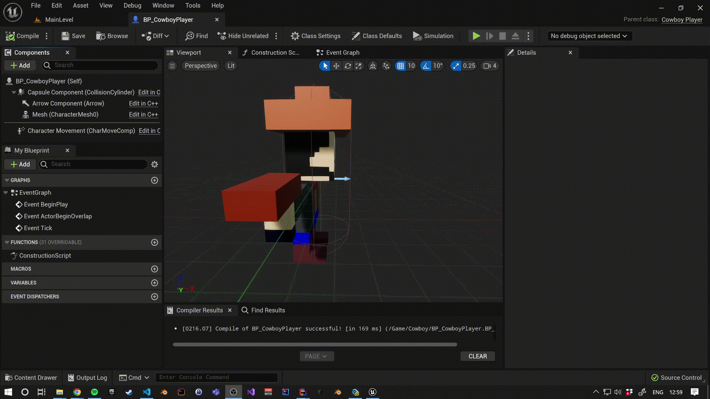

Finalmente crearemos un Blueprint que herede de `AGameModeBase`, para indicar las clases por defecto que se usarán en nuestro juego, como hemos visto en teoría. En nuestro caso solo será el `Default Pawn` por nuestro Cowboy. También actualizaremos la configuración general para usar este Blueprint por defecto en todos los niveles:

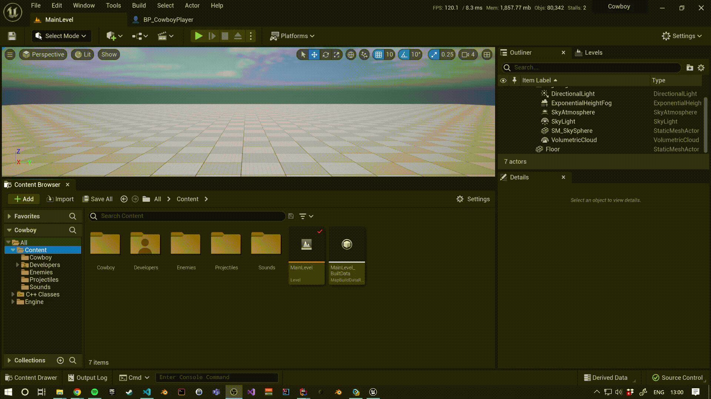


> Esta clase podríamos crearla en C++, o crear una base de GameMode en C++ y luego heredar en Blueprint. Pero como en este juego no tendremos lógica complicada de reglas de juego, podemos evitarlo. Además, como queremos indicar que el `Default Pawn` es un asset de Blueprint, si lo indicaramos en C++ habría que _"hardcodear"_ el path de ese Blueprint y no es buena práctica. Para esos casos, lo normal es crear una clase de C++ con una propiedad de `TSubclassOf<>`, heredarla en Blueprint e indicar en el Blueprint la referencia. Veremos un ejemplo más abajo.

Podemos comprobar en el fichero `Config/DefaultEngine.ini` como se ha añadido esta configuración:

```diff
 [/Script/EngineSettings.GameMapsSettings]
 EditorStartupMap=/Game/MainLevel.MainLevel
 GameDefaultMap=/Game/MainLevel.MainLevel
+GlobalDefaultGameMode=/Game/BP_MainGameMode.BP_MainGameMode_C
```

## Enemigo

Como hemos visto en teoría, existen los `APawn` y los `AController`. Los primeros se encargan de reprensentar a un objecto _con vida_ de nuestro juego y los segundos se encargan de _controlarlo_, como si fuera su cerebro. En el caso del `AController` existen dos subclases: `AAIController` y `APlayerController`.

Los `APawn` (o `ACharacter` ya que heredan de ellos), cuando son controlados por un `ULocalPlayer` se les crea una `APlayerController` usando la clase indicada en el `AGameModeBase` del nivel (o del proyecto).
Cuando un `APawn` no es controlado por un jugador, se presupone que tiene que ser controlado por una inteligencia artificial, por lo que (dependiendo de la propiedad [`APawn::AutoPossessAI`](https://github.com/EpicGames/UnrealEngine/blob/release/Engine/Source/Runtime/Engine/Classes/GameFramework/Pawn.h#L105-L111)) se le creará un `AAIController` según la clase indicada en la propiedad [`APawn::AIControllerClass`](https://github.com/EpicGames/UnrealEngine/blob/release/Engine/Source/Runtime/Engine/Classes/GameFramework/Pawn.h#L117-L119).

> Nota: Vemos como la propiedad `APawn::AIControllerClass` es una `UPROPERTY` y del tipo `TSubclassOf<AController>`. Lo que en el Blueprint se reflejará como on _Dropdown_ de clases que hereden de `AController`:
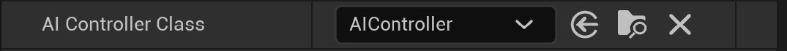


Dicho esto, crearemos un `APawn` para nuestro enemigo base y un `AAIController` para la lógica de ese enemigo.

### AI Controller

Comos vamos a crear usar el módulo de AI, necesitamos incluir en nuestras dependencias, así que en el fichero `Source/CowboyCore/CowboyCore.Build.cs` añadiremos el módulo `AIModule` a la lista de `PublicDependencyModuleNames`:

```diff
     {
         PCHUsage = PCHUsageMode.UseExplicitOrSharedPCHs;

-        PublicDependencyModuleNames.AddRange(new string[] { "Core", "CoreUObject", "Engine" });
+        PublicDependencyModuleNames.AddRange(new string[] { "Core", "CoreUObject", "Engine", "AIModule" });
         PrivateDependencyModuleNames.AddRange(new string[] { });
     }
 }
```

Añadiremos una clase que herede de actor (luego le cambiaremos la herencia) que se llame `AIEnemyController`:

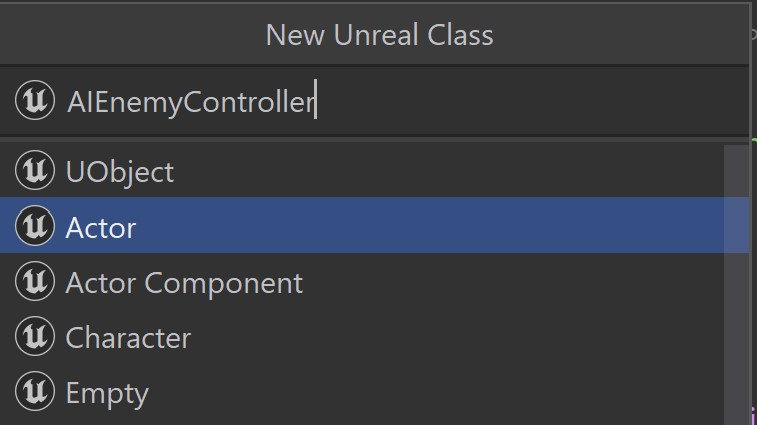

El cuerpo de `Source/CowboyCore/AIEnemyController.h` será:

```cpp
#pragma once

#include "CoreMinimal.h"
#include "AIController.h"
#include "CowboyPlayer.h"
#include "AIEnemyController.generated.h"

UCLASS()
class COWBOYCORE_API AAIEnemyController : public AAIController
{
	GENERATED_BODY()

protected:
	virtual void BeginPlay() override;
	virtual void OnPossess(APawn* InPawn) override;

private:
	UPROPERTY()
	ACowboyPlayer* TargetPlayer;

	void FollowPlayer();
	void OnMovementProcessed(UPathFollowingComponent* Component, FVector& Velocity);
	void OnFollowCompleted(FAIRequestID RequestID, const FPathFollowingResult& Result);
};
```

Diseccionando el código anterior:

1. Extendemos el método `BeginPlay` para inicializar una variable y unos Delegates. Este método será llamado cuando empiece el juego o se haga Spawn de este actor. Es importante inicializar estos valores aquí y no el constructor, ya que como vimos en teoría, el constructor es llamado cuando se crea el [CDO](https://docs.unrealengine.com/4.26/en-US/ProgrammingAndScripting/ProgrammingWithCPP/UnrealArchitecture/Objects/) de esta clase, no cuando comienzamos a jugar.
2. Extendemos el método `OnPosses`, que es llamado cuando un `AController` empieza a _poseer_ a un `APawn`. Aquí le diremos, que cuando empiece a ser _poseído_, que empiece a seguir al jugador.
3. Declaramos un miembro interno llamado `TargetPlayer`. Aunque sea un miembro privado y no lo vayamos a exponer a un Blueprint, debemos añadirle el macro `UPROPERTY`, ya que al ser un puntero el _recolector de basura_ de UE podría eliminarlo de memoria sin entender que está siendo referenciado.
4. Declaramos una funcion `FollowPlayer`, donde indicaremos la lógica para cómo seguir al jugador.
5. Declaramos una función `OnMovementProcessed` que va a ser enlazada a un `Delegate` del componente [`UPathFollowingComponent` que tiene la clase `AIController`](https://github.com/EpicGames/UnrealEngine/blob/release/Engine/Source/Runtime/AIModule/Classes/AIController.h#L128). Esta función se va a llamar cada vez que se procese un nuevo movimiento.
6. Declaramos otra función `OnFollowCompleted` que enlazaremos a otro Delegate y nos indicará cuándo se ha terminado de ejecutar el seguimiento.

> [Los Delegates](https://docs.unrealengine.com/5.0/en-US/delegates-and-lamba-functions-in-unreal-engine/) son como _callbacks_ (similar a los Event Dispatchers en Blueprint), en los que se declara qué parámetros va a recibir una función y se les pueden enlazar funciones (una o varias, si son MulticastDelegates). Esto nos permite desacoplar código y ayudar a la modularidad de otras partes de nuestro juego. En el caso anterior, enlazaremos [estos delegates](https://github.com/EpicGames/UnrealEngine/blob/46544fa5e0aa9e6740c19b44b0628b72e7bbd5ce/Engine/Source/Runtime/AIModule/Classes/Navigation/PathFollowingComponent.h#L216-L229).

Y el cuerpo de `Source/CowboyCore/AIEnemyController.cpp` será:

```cpp
#include "AIEnemyController.h"
#include "Kismet/GameplayStatics.h"

void AAIEnemyController::BeginPlay()
{
	Super::BeginPlay();

	TargetPlayer = Cast<ACowboyPlayer>(UGameplayStatics::GetActorOfClass(GetWorld(), ACowboyPlayer::StaticClass()));

	GetPathFollowingComponent()->PostProcessMove.BindUObject(this, &ThisClass::OnMovementProcessed);
	GetPathFollowingComponent()->OnRequestFinished.AddUObject(this, &ThisClass::OnFollowCompleted);
	FollowPlayer();
}

void AAIEnemyController::OnPossess(APawn* InPawn)
{
	Super::OnPossess(InPawn);
	FollowPlayer();
}

void AAIEnemyController::FollowPlayer()
{
	if (TargetPlayer)
	{
		MoveToActor(TargetPlayer, -1.f, false);
	}
}

void AAIEnemyController::OnMovementProcessed(UPathFollowingComponent* Component, FVector& Velocity)
{
	FVector Direction = Velocity;
	Direction.Z = 0.f;
	GetPawn()->SetActorRotation(Direction.Rotation());
}

void AAIEnemyController::OnFollowCompleted(FAIRequestID RequestID, const FPathFollowingResult& Result)
{
	FollowPlayer();
}
```

Diseccionado el código anterior:
1. En `BeginPlay`:
    1. Usamos la clase `UGameplayStatics` para buscar la instancia en el nivel que hereda de la clase `ACowboyPlayer` y lo guardamos en la propiedad `TargetPlayer`.
    2. Enlazamos al delegate `PostProcessMove` nuestra función `OnMovementProcessed`.
    3. Enlazamos al delegate `OnRequestFinished` nuestra función `OnFollowCompleted`.
    > Aquí estamos usando [`ThisClass`](https://github.com/EpicGames/UnrealEngine/blob/release/Engine/Source/Runtime/CoreUObject/Public/UObject/ObjectMacros.h#L1639-L1646). Es un alias a la clase actual que UE nos provee (al igual que `Super`), podríamos usar `&AAIEnemyController::OnFollowCompleted`, pero es más verboso.
    4. Llamamos a `FollowPlayer` para iniciar el seguimiento.
2. En `OnPosses` llamamos a `FollowPlayer` para inciar el seguimiento. Cuando el actor **no** está situado en el nivel desde el inicio (es decir, cuando hacemos un Spawn), `BeginPlay` se llamará antes que `OnPosses`, por lo que no tenemos un `Pawn` poseído y el `MoveToActor` no funcionará, por eso tenemos que llamarlo aquí también.
3. En `FollowPlayer` comprobamos que tenemos una referencia **válida** de nuestro _target_ e invocamos el metodo `AAIController::MoveToActor`, diciéndole que el `AcceptanceRadius` sea el mínimo por defecto y que no se pare cuando haga _overlap_.
4. En `OnMovementProcessed` usamos el componente de `Velocity` en el plano horizontal y decimos que actualice la orientación de nuestro actor hacia donde apunta su velocidad. Es decir, que mire hacia donde estamos yendo.
5. En `OnFollowCompleted` volvemos a llamar otra vez a `FollowPlayer`, para que siga persiguiendo a nuestro jugador indefinidamente, aunque choquemos con él una vez.

> El Delegate `OnRequestFinished` se invocará cuando no podamos hacer un movimiento porque estemos bloquedos, fuera de la navegación, o porque ya hayamos llegado a destino.

### Enemy

Ahora crearemos una clase que herede de `APawn` y la llamaremos `Enemy`.

Como la lógica de nuestro enemigo es muy simple, esta clase solo tendrá lo siguiente.

En `Source/CowboyCore/Enemy.h` solo existirá un constructor y un componente `UFloatingPawnMovement` para moverse:

```cpp
#pragma once

#include "CoreMinimal.h"
#include "GameFramework/FloatingPawnMovement.h"
#include "GameFramework/Pawn.h"
#include "Enemy.generated.h"

UCLASS()
class COWBOYCORE_API AEnemy : public APawn
{
	GENERATED_BODY()

protected:
	AEnemy();

public:
	UPROPERTY(EditDefaultsOnly)
	UFloatingPawnMovement* FloatingPawnMovement;
};
```

En la unidad de compilación `Source/CowboyCore/Enemy.cpp`:

```cpp
#include "Enemy.h"
#include "AIEnemyController.h"

AEnemy::AEnemy()
{
	FloatingPawnMovement = CreateDefaultSubobject<UFloatingPawnMovement>("FloatingPawnMovement");
	AIControllerClass = AAIEnemyController::StaticClass();
	AutoPossessAI = EAutoPossessAI::PlacedInWorldOrSpawned;
}
```

Aquí solo creamos el componente llamando a la función `CreateDefaultSubobject`, le decimos que clase queremos para nuestro `AIController` y le indicamos que queremos que siempre se cree un `AIController` cuando se coloque en el nivel o cuando se haga un Spawn dinámicamente.

> Podemos recompilar el proyecto en cualquier momento con <kbd>ctrl</kbd> + <kbd>alt</kbd> + <kbd>F11</kbd>. Si por algún casual tuvieramos un error de archivos temporales (a veces los Blueprint no se recompilan correctamente), podríamos probar a parar el editor y volver a lanzarlo.

#### Cactus

Finalmente, vamos a crear una clase de Blueprint llamada `BP_Cactus` que herede de `Enemy`:

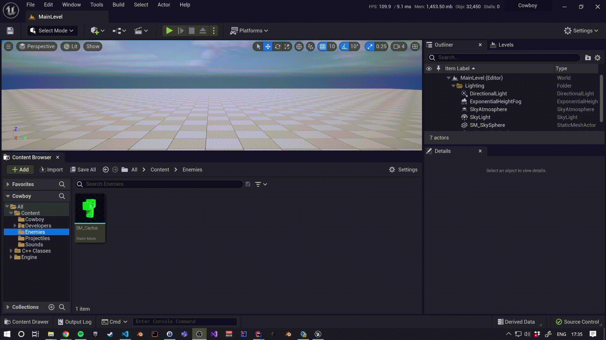

Dentro de este Blueprint:
1. Crearemos una cápsula para gestionar las colisiones y usarla como base.
2. Añadiremos una malla estática sin colisiones con nuestro cactus.
3. Y le diremos que la velocidad máxima de nuestro `FloatingPawnMovement` sea de `300`.


> Cuando la IA hace la navegación, tomará el lado más grande de nuestra colisión como referencia, por lo que necesitamos que sobresalga de la capsula, si no el lado más estrecho del Cactus nunca llegaría a alcanzar a nuestro jugador.

### Navigation path

Dentro del editor, aprovecharemos para colocar un Nav Mesh Volume, que indicará a nuestro enemigo por dónde se puede mover y un Player Start, que indicará dónde se tiene que hacer Spawn de nuestro vaquero:


## Generador de enemigos

### Blueprint

## Proyectiles

### Blueprint

## Shooting Component


## Siguiente

En el siguiente paso gestionaremos el input de nuestro juego, pero antes guardaremos y haremos commit de nuestro cambios en Git:

```sh
$ git add .
$ git commit -m "Add main classes"
```

[Ir al siguente](04_input_routing.md)