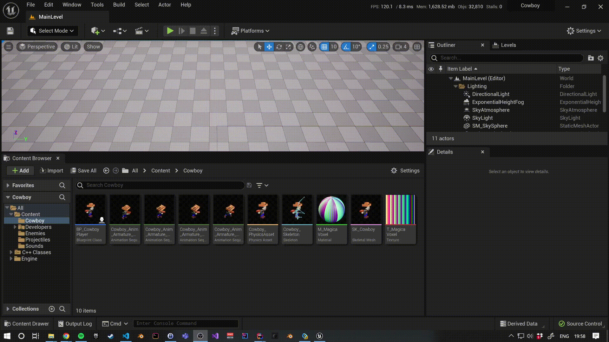

# Gestión de input

[Volver al anterior](03_main_classes.md)

## Input Actions e Input Axis

En juegos más profesionales usaríamos el plugin de [Enhanced Input](https://docs.unrealengine.com/5.0/en-US/enhanced-input-in-unreal-engine/), pero para juegos básicos como los de clase, solo necesitamos conocer dos tipos de gestión de inputs: acciones y ejes.

Las acciones nos permiten escuhar por teclas o botones y se lanzarán una vez cuando sean presionados y otra vez cuando sean soltados.

Los ejes, en cambio, estarán escuhando continuamente por los valores que proporcionan un eje que nosotros creemos. Si este eje se trata de un eje _virtual_ que estemos creando con teclas (en lugar de, por ejemplo, un joystick), recibirá el valor completo que le asignemos a la tecla cuando esta sea presionada y `0` cuando ninguna tecla sea presionada.

Crearemos una acción para disparar con la barra espaciadora y 4 ejes:
1. Para movernos arriba y abajo
2. Para movernos derecha e izquierda
3. Para girarnos arriba y abajo
4. Para girarnos derecha e izquierda

La manera más sencilla de crear estos _mappings_ es en los ajustes del proyecto:

> Nota: Para seleccionar rápidamente una tecla, hacemos click una vez en el icono a la izquierda del input y apretamos la tecla. Cuando hacemos click en el icono, UE escuchará por el siguiente input a continuación (ya bien sea ratón, teclado o gamepad).




Cuando modifiquemos nuestros valores, veremos que se nos ha modificado el fichero `Config/DefaultInput.ini`, y dentro de este fichero podemos ver nuestros mappings aquí:

```ini
+ActionMappings=(ActionName="Shoot",bShift=False,bCtrl=False,bAlt=False,bCmd=False,Key=SpaceBar)
+AxisMappings=(AxisName="MoveForward",Scale=1.000000,Key=W)
+AxisMappings=(AxisName="MoveForward",Scale=-1.000000,Key=S)
+AxisMappings=(AxisName="MoveRight",Scale=1.000000,Key=D)
+AxisMappings=(AxisName="MoveRight",Scale=-1.000000,Key=A)
+AxisMappings=(AxisName="RotateUp",Scale=1.000000,Key=Up)
+AxisMappings=(AxisName="RotateUp",Scale=-1.000000,Key=Down)
+AxisMappings=(AxisName="RotateRight",Scale=1.000000,Key=Right)
+AxisMappings=(AxisName="RotateRight",Scale=-1.000000,Key=Left)
```

> En un fichero ini, cuando el valor de la clave va precedido por un `+` significa que esta _"añadiendo"_ un elemento a una lista o un array. En el caso anterior, `AxisMappings` hace referencia exactamente a la propiedad [`AxisMappings` de la clase `UInputSettings`](https://github.com/EpicGames/UnrealEngine/blob/38aabe84016d888c4f83875601146c0c852ebaaa/Engine/Source/Runtime/Engine/Classes/GameFramework/InputSettings.h#L117-L118). La clase tiene el especificador `config` y la propiedad también.

## Cowboy Player

Una vez creados nuestros mappings, vamos a asignarlo a funciones específicas en nuestro personaje. En un juego más complejo, esta gestión de input debería ir gestionada en un `APlayerController` personalizado, pero como nuestro juego es simple, lo dejaremos aquí.

Modificaremos la cabecera de nuestro `CowboyPlayer.h` y añadiremos lo siguiente:

```diff
 public:
        ACowboyPlayer();
+       virtual void SetupPlayerInputComponent(UInputComponent* PlayerInputComponent) override;

        UPROPERTY(EditDefaultsOnly, Category = "Cowboy Shooting")
        UShootingComponent* ShootingComponent;
+
+private:
+       void MoveForward(float Value);
+       void MoveRight(float Value);
+       void RotateUp(float Value);
+       void RotateRight(float Value);
+
+       FVector CurrentRotationDirection = FVector::ZeroVector;
 };
```

Aquí cambiamos lo siguiente:
1. Sobreescribimos el método `SetupPlayerInputComponent`, donde podremos añadir nuestros _"mapeos"_.
2. Creamos 4 funciones privadas que gestionarán el input de movimiento.
3. Creamos una propiedad que nos servirá para guardar la rotación actual (ya que esta va a diferir de la dirección del movimiento).

Y en el cuerpo `CowboyPlayer.cpp` añadiremos lo siguiente:

```diff
ACowboyPlayer::ACowboyPlayer()
 {
+       bUseControllerRotationYaw = false;
        ShootingComponent = CreateDefaultSubobject<UShootingComponent>("ShootingComponent");
 }

+void ACowboyPlayer::SetupPlayerInputComponent(UInputComponent* PlayerInputComponent)
+{
+       Super::SetupPlayerInputComponent(PlayerInputComponent);
+
+       InputComponent->BindAxis("MoveForward", this, &ACowboyPlayer::MoveForward);
+       InputComponent->BindAxis("MoveRight", this, &ACowboyPlayer::MoveRight);
+       InputComponent->BindAxis("RotateUp", this, &ACowboyPlayer::RotateUp);
+       InputComponent->BindAxis("RotateRight", this, &ACowboyPlayer::RotateRight);
+       InputComponent->BindAction("Shoot", IE_Pressed, ShootingComponent, &UShootingComponent::Shoot);
+}
+
+void ACowboyPlayer::MoveForward(float Value)
+{
+       const FVector Direction = FRotationMatrix(Controller->GetControlRotation()).GetScaledAxis(EAxis::X);
+       AddMovementInput(Direction, Value);
+}
+
+void ACowboyPlayer::MoveRight(float Value)
+{
+       const FVector Direction = FRotationMatrix(Controller->GetControlRotation()).GetScaledAxis(EAxis::Y);
+       AddMovementInput(Direction, Value);
+}
+
+void ACowboyPlayer::RotateUp(float Value)
+{
+       CurrentRotationDirection.X = Value;
+
+       if (FMath::IsNearlyZero(Value)) return;
+       SetActorRotation(CurrentRotationDirection.Rotation());
+}
+
+void ACowboyPlayer::RotateRight(float Value)
+{
+       CurrentRotationDirection.Y = Value;
+
+       if (FMath::IsNearlyZero(Value)) return;
+       SetActorRotation(CurrentRotationDirection.Rotation());
+}
```

Diseccionando este cambio:

1. En el constructor decimos que queremos ignorar la rotación del controlador (para que el peón rote por su cuenta) con la variable `bUseControllerRotationYaw`, que por defecto es `true`.
2. En el método `SetupPlayerInputComponent`:
    1. Al `InputComponent` que recibimos como parámetro, le decimos que queremos suscribirnos a cada uno de los input Input Axis (el nombre de estos tiene que ser el mismo que en el fichero `.ini`), le pasamos la instancia actual de nuestro CowboyPlayer con `this` y la referencia a la función.
    2. También le decimos que queremos suscribirnos al Input Action de `"Shoot"`. Aquí indicamos que nos queremos suscribir cuando presionamos el input (on el enum `IE_PRESSED` (hay más valores que podríamos [consultar aquí](https://github.com/EpicGames/UnrealEngine/blob/38aabe84016d888c4f83875601146c0c852ebaaa/Engine/Source/Runtime/Engine/Classes/Engine/EngineBaseTypes.h#L25-L34)). Finalmente, en lugar de enlazar a una función de CowboyPlayer, le enlazamos directamente la función `Shoot` del componente `UShootingComponent`, para ello le pasamos la instancia de dicho componente y la referencia de la función.
3. Creamos las funciones de movimiento `MoveForward` y `MoveRight`, que obtendrán los ejes de coordenadas de hacia donde está mirando nuestra cámara (que en nuestro caso es lo mismo que hacia donde mira el Controller) y le añadimos movimiento a nuestro actor en ese eje con el valor que recibimos del input.
4. Creamos las funciones de rotación `RotateUp` y `RotateRight` que:
    1. Actualizarán solo el eje correspondiente del vector `CurrentRotationDirection`.
    2. En el caso de que el Input Axis esté recibiendo `0`, no actualizamos la posición, para evitar resetear al jugador a una rotación no deseada.
    3. De lo contrario, actualizamos la rotación del actor a la rotación que tiene ese vector de dirección.

---

## Siguiente

En el siguiente paso añadiremos animaciones a nuestro vaquero, pero antes guardaremos y haremos commit de nuestro cambios en Git:

```sh
$ git add .
$ git commit -m "Add input routing"
```

[Ir al siguente](05_animations.md)
