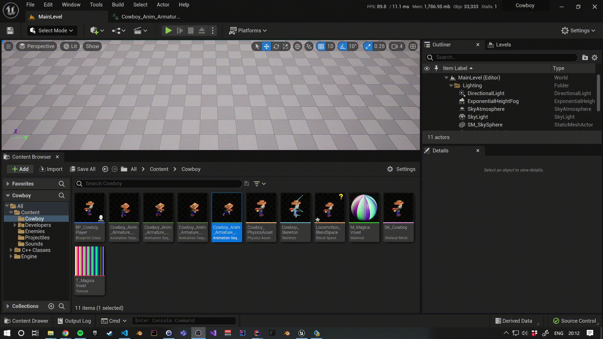
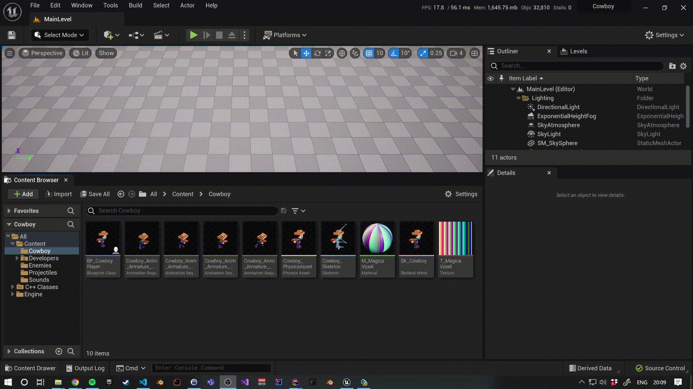
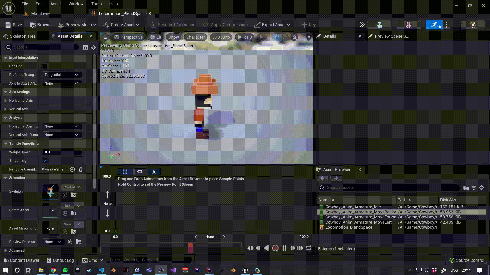
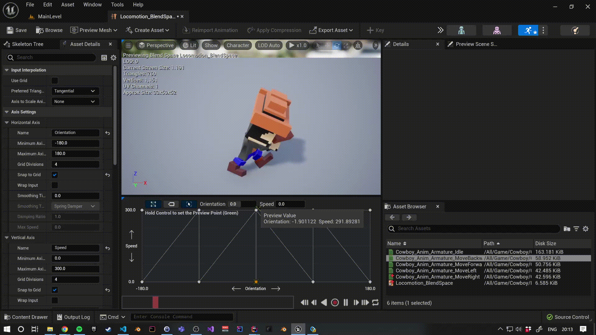
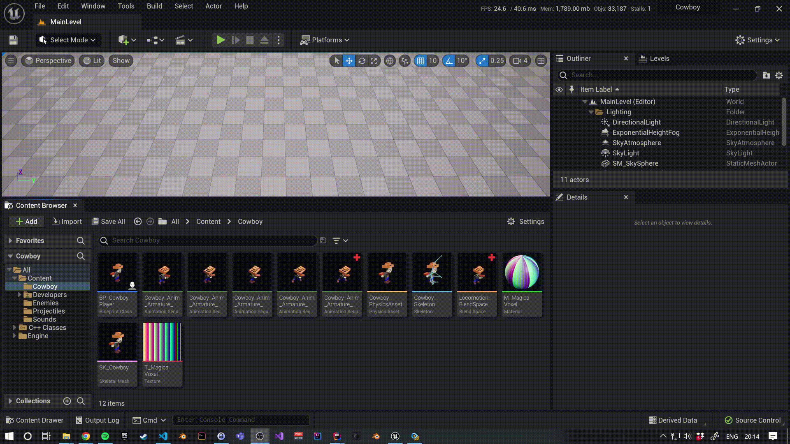
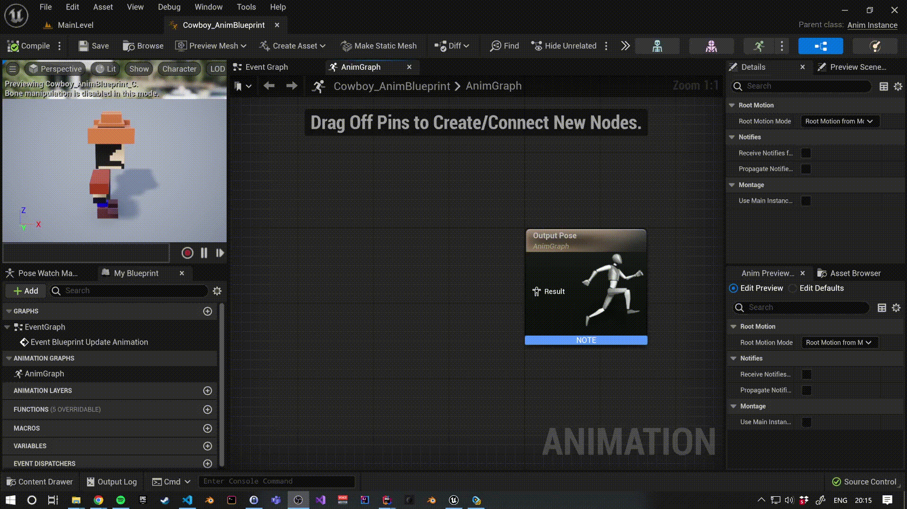
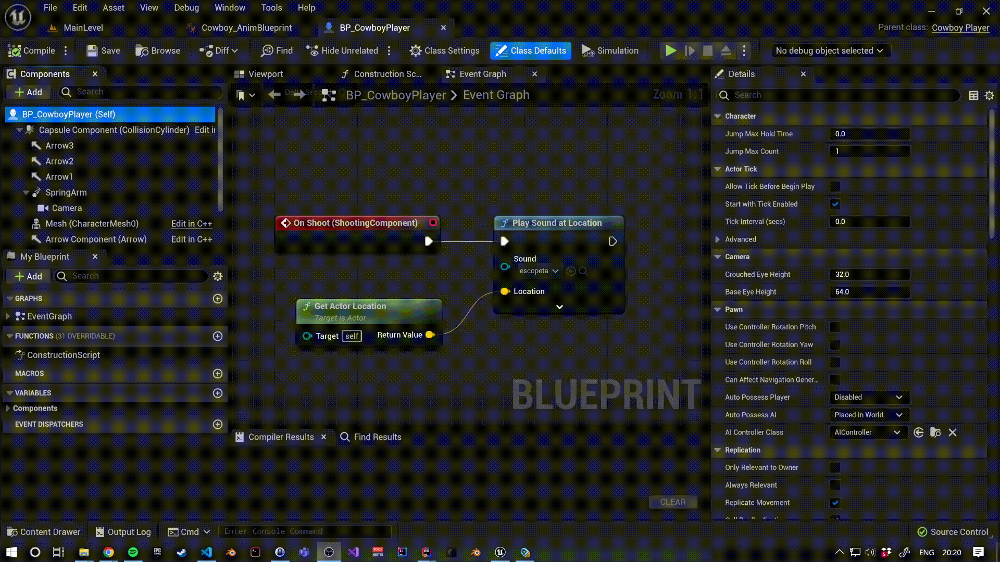

# Animaciones

[Volver al anterior](04_input_routing.md)

En esta sección, dotaremos a al componente de malla esqueletal de nuestro vaquero con animaciones.

Un `USkeletalMeshComponent` ejecuta (o _evalúa_) la animación indicada en una propiedad llamada [`AnimInstance`](https://github.com/EpicGames/UnrealEngine/blob/38aabe84016d888c4f83875601146c0c852ebaaa/Engine/Source/Runtime/Engine/Classes/Components/SkeletalMeshComponent.h#L92) (del tipo [`UAnimInstance`](https://github.com/EpicGames/UnrealEngine/blob/38aabe84016d888c4f83875601146c0c852ebaaa/Engine/Source/Runtime/Engine/Classes/Animation/AnimInstance.h#L362)). Este `AnimInstance` puede ser un simple _asset_ de una animación, un [`UAnimBlueprint`](https://github.com/EpicGames/UnrealEngine/blob/38aabe84016d888c4f83875601146c0c852ebaaa/Engine/Source/Runtime/Engine/Classes/Animation/AnimBlueprint.h#L77) u otro tipo de de clase que herede de `UAnimInstance`, todo depende [del tipo de animación que le señalemos](https://github.com/EpicGames/UnrealEngine/blob/38aabe84016d888c4f83875601146c0c852ebaaa/Engine/Source/Runtime/Engine/Classes/Components/SkeletalMeshComponent.h#L190-L193).

En nuestro caso, queremos que exista cierta lógica en nuestra animación: queremos que el vaquero sepa estar parado y moverse adelante, atrás y de lado, y además queremos que sea de manera gradual (es decir, que no salte entre animaciones bruscamente). Para esta lógica utilizaremos dos elementos:
1. Crearemos un `AnimBlueprint` que nos servirá para separar la lógica de la representación gráfica de nuestro jugador, evaluando su velocidad y dirección.
2. Crearemos un [`BlendSpace`](https://docs.unrealengine.com/5.0/en-US/blend-spaces-in-unreal-engine/), que nos permitirá [**interpolar**](https://en.wikipedia.org/wiki/Interpolation) las transformaciones de los huesos de varias animaciones de manera gradual en base a unos parámetros.

## Caminar hacia la derecha

Antes de nada, si nos fijamos, solo tenemos una animación (`MoveLeft`) de movernos de manera lateral. Por lo tanto aprovecharemos para duplicar esta animación e indicar que la velocidad de reproducción de esta sea invertida, así tendremos una animación de caminar hacia la derecha.



## Blend Space

A continuación, crearemos un Blend Space que llamaremos `Locomotion_BlendSpace`:
> Normalmente, al conjunto de animaciones que definen el movimiento de nuestro personaje se suelen llamar _Locomotion_. De hecho, existen _frameworks_ que proveen de toda esta funcionalidad, como, por ejemplo, el [ALS (Advanced Locomotion System)](https://www.unrealengine.com/marketplace/en-US/product/advanced-locomotion-system-v1).



Una vez dentro del Blend Space, indicaremos que el eje horizontal nos servirá para representar el parámetro de la orientación (con valores entre `-180` y `180`) y el vertical para representar el parámetro de la velocidad (con valores de `0` a `300`).



Finalmente arrastraremos en el grid cada una de las animaciones a su punto correspondiente.


Con el resultado final, podemos mantener la tecla <kbd>crtl</kbd> presionada y hacer _hover_ sobre el grid para ver una previsualización de la interpolación.




## Animation Blueprint

Una vez ya tenemos todas nuestras animaciones listas (en este caso solo nuestro Blend Space), pasaremos a crear un Animation Blueprint llamado `Cowboy_AnimBlueprint`.



Los Animation Blueprint tienen varias peculiaridades:
1. Siempre llevan asignado un esqueleto (para saber que animaciones representar).
2. Normalmente casi siempre, pero **no siempre**, tienen un dueño que es el `APawn` que es dueño del `USkeletalMeshComponent` pertinente y ejecutando esa animación. Sin embargo, hay casos en los que el AnimBlueprint _existe_ en el `UWorld` (es decir, está siendo actualizado), pero no posee un dueño, por ejemplo, si destruimos el peón dueño por cualquier motivo (por ejemplo, un enemigo al que hemos matado). Por lo tanto, es importante que comprobemos que el peón dueño es una referencia válida y no es nulo.
3. Los Animation Blueprint tienen dos tipos de grafos que se ejecutan en dos hilos diferentes: el _Event Graph_ se suele ejecutar en el _Game Thread_ (o normalmente conocido como _CPU Thread_) y el _Anim Graph_ (donde indicamos qué animaciones evaluar) se ejecuta en un _Worker Thread_, por lo que es importante ser consciente de las actualizaciones de variables y evitar condiciones de carrera dentro del _Anim Graph_. Puedes informarte [más aquí sobre los hilos y tipos de grafos](https://docs.unrealengine.com/5.0/en-US/graphing-in-animation-blueprints-in-unreal-engine/).

Dicho esto, dentro del _Anim Graph_ arrastraremos nuestro Blend Space.



Luego, dentro del _Event Graph_, cada vez que se actualice la animación, actualizaremos una variable `Speed` que le pasaremos a nuestro Anim Graph.

> Nota: Aquí comprobamos que el peón dueño no sea nulo cuando ejecutamos esta lógica, para evitar null pointer exceptions.

Podriamos hacer añadir un getter de la variable `Speed` y arrastrarlo directamente al pin del Blend Space, pero Unreal Engine 5 nos provee un nuevo método que son los [Property Accessors](https://docs.unrealengine.com/5.0/en-US/graphing-in-animation-blueprints-in-unreal-engine/#propertyaccess) que simplifican nuestro grafo y además lo hacen _Thread Safe_.


De la misma manera, crearemos actualizaremos una variable `Orientation`, que obtendremos de la diferencia entre a dónde miramos y hacia donde vamos.


Por último, añadiremos este nuevo Animation Blueprint al Skeletal Mesh Component de nuestro `BP_Cowboy`.



## Resultado final

Si le damos al play, ahora veremos que nuestro vaquero se mueve correctamente.


---

## Siguiente

En el siguiente paso finalizaremos el proyecto añadiendo las colisiones necesarias a los disparos, pero antes guardaremos y haremos commit de nuestro cambios en Git:

```sh
$ git add .
$ git commit -m "Add animations"
```


[Ir al siguente](06_collisions_and_following.md)
